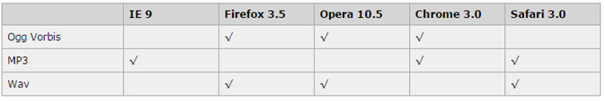
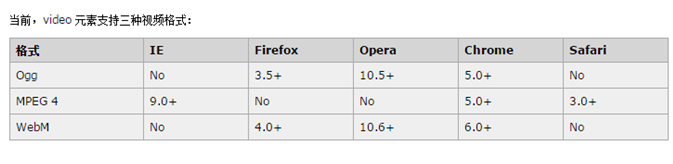

# h5标签属性和css3属性简介

## 1. HTML5新增布局标签

- 头部 **<header></header>**
- 导航  **<nav></nav>**
- 文章**<article></article>**
- 侧边栏  **<aside></aside>**
- 区块  **<section></section>**
- 底部  **<footer></footer>**

## 2.HTML5音频视频标签

### 2.1音频

HTML5通过<audio>标签来解决音频播放的问题。

使用相当简单 src链入音频路径既可

​            **<audio src="a.mp3">    </audio>**            

并且可以通过附加属性可以更友好控制音频的播放，如：

autoplay 自动播放

controls 是否显不默认播放控件

loop 循环播放

由于版权等原因，不同的浏览器可支持播放的格式是不一样的，如下图供参考

**多浏览器支持的方案，如下图**

 

**多浏览器解决方案:**

```
<audio controls>
	<source src="a.mp3">
	<source src="a.wav">
	<source src="a.ogg">
	您的浏览器版本过低,请升级
</audio>
```

## 2.2视频

HTML5通过<video>标签来解决视频播放的问题。

同音频播放一样，<video>使用也相当简单，

```
<video src="a.mp4"></video>                         
```

同样，通过附加属性可以更友好的控制视频的播放

autoplay 自动播放

controls 是否显示默认播放控件

loop 循环播放

width 设置播放窗口宽度

height 设置播放窗口的高度

由于版权等原因，不同的浏览器可支持播放的格式是不一样的，如下图供参考

 

**多浏览器支持的方案**

```
<video>
	<source src="movie.mp4">
	<source src="movie.ogg">
</video>
```

## 3. html5表单元素

| **类型****** | **使用示例******          | **含义****** |
| ---------- | --------------------- | ---------- |
| **email**  | <input type="email">  | 输入邮箱格式     |
| **tel**    | <input type="tel">    | 输入手机号码格式   |
| **url**    | <input type="url">    | 输入url格式    |
| **number** | <input type="number"> | 输入数字格式     |
| **date**   | <input type="date">   |            |

## 4. html5表单属性

| **属性******       | **用法******                               | **含义****** |
| ---------------- | ---------------------------------------- | ---------- |
| **placeholder**  | <input type="text" placeholder="请输入用户名"> | 占位符        |
| **autofocus**    | <input type="text" autofocus>            | 自动获得焦点     |
| **autocomplete** | <input type="text"  autocomplete="off">  | 自动完成       |
| **required**     | <input type="text" required>             | 必填项        |

## 5. css3盒模型

- box-sizing:content-box;

  padding和border不被包含在定义的width和height之内。对象的实际宽度等于设置的width值和border、padding之和，即 ( Element width = width + border + padding ) 

  此属性表现为标准模式下的盒模型。 

- box-sizing:border-box; 

  padding和border被包含在定义的width和height之内。对象的实际宽度就等于设置的width值，即使定义有border和padding也不会改变对象的实际宽度，即 ( Element width = width ) 

  此属性表现为怪异模式下的盒模型。 

## 6. 背景属性

### 6.1背景尺寸:backgroud-size:

检索或设置对象的背景图像的尺寸大小。

- 该属性提供2个参数值(特性值cover和contain除外)。 

  - cover： 

    将背景图像等比缩放到完全覆盖容器，背景图像有可能超出容器。 

  - contain： 

    将背景图像等比缩放到宽度或高度与容器的宽度或高度相等，背景图像始终被包含在容器内。 

- 如果提供两个具体的值(百分比或者像素值)，第一个用于定义背景图像的宽度，第二个用于定义背景图像的高度。 

- 如果只提供一个值，该值将用于定义背景图像的宽度，第2个值默认为auto，即高度为auto，此时背景图以提供的宽度作为参照来进行等比缩放。

  代码示例

  ```
  background-size: cover;
  background-size: contain;
  background-size: 50% 50%;
  background-size: 200px 300px;
  background-size: 200px;
  ```

### 6.2背景线型渐变

```
自左向右:background-image: linear-gradient(to right,white, gray);
自右向左:background-image: linear-gradient(to left,white, gray);
自上向下:background-image: linear-gradient(to bottom,white, gray);
自下向上:background-image: linear-gradient(to top,white, gray);
注意:多组颜色之间逗号隔开
```

### 6.3多背景图片

```
background:url(test1.jpg) no-repeat  10px 20px/50px 60px,
	   url(test2.jpg) no-repeat  10px 20px/70px 90px,
	   url(test3.jpg) no-repeat  10px 20px/110px 130px #ccc;
	   多张背景图片之间用逗号隔开
注意， 背景颜色只能设置一次，且由于写在前面的背景会叠在之后的背景之上，所以背景色通常都定义在最后一组上，避免背景色将图像盖住。
```